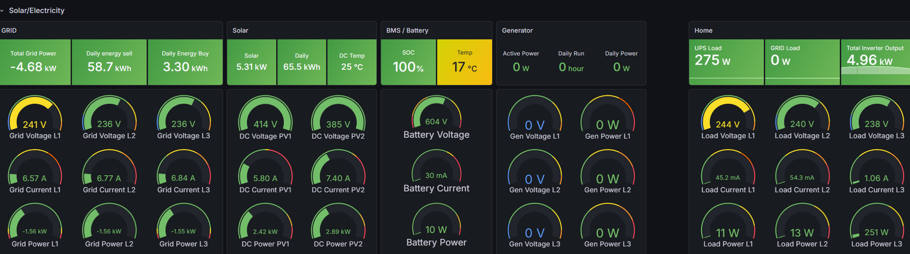

# jinko-exporter

`jinko-exporter` is a Prometheus exporter with pluggable data sources:

- `jinko`: private browser-backed Jinko detail API
- `solarman`: Solarman OpenAPI
- `modbus`: placeholder module until the local protocol/register map is confirmed

The exporter polls upstream on a fixed interval, keeps the latest snapshot in memory, and exposes Prometheus metrics on HTTP.

    

## Metrics

The exporter exposes:

- `solar_up{source,device_sn}`
- `solar_last_update_timestamp_seconds{source,device_sn}`
- `solar_last_source_sync_timestamp_seconds{source}`
- `solar_poll_duration_seconds{source}`
- `solar_request_errors_total{source}`
- `solar_metric{source,device_sn,group,key,name,unit}`

`solar_metric` is the generic numeric metric stream. For the Jinko detail source it uses values from `paramCategoryList.fieldList`, typically keyed by `storageName`.

Set `EXPORTER_METRICS_DROP_SOURCE_LABEL=true` to remove the `source` label from generic metrics. `solar_last_source_sync_timestamp_seconds{source}` still keeps the source label so failover source changes remain visible.

## Home Assistant MQTT

Read-only Home Assistant MQTT Discovery is optional.

When enabled, the exporter publishes retained discovery configs and a retained JSON state payload after each successful poll. Home Assistant gets one device with entities for every numeric metric returned by the source, plus diagnostics and binary problem sensors for alarm/fault values.

Minimum config:

- `--mqtt-enabled` / `MQTT_ENABLED=true`
- `--mqtt-broker` / `MQTT_BROKER=tcp://homeassistant.local:1883`
- `--mqtt-username` / `MQTT_USERNAME`
- `--mqtt-password` / `MQTT_PASSWORD`

Useful optional config:

- `--mqtt-topic-prefix` / `MQTT_TOPIC_PREFIX`
- `--mqtt-discovery-prefix` / `MQTT_DISCOVERY_PREFIX`
- `--mqtt-device-name` / `MQTT_DEVICE_NAME`
- `--mqtt-device-id` / `MQTT_DEVICE_ID`
- `--mqtt-client-id` / `MQTT_CLIENT_ID`
- `--mqtt-retain` / `MQTT_RETAIN`
- `--mqtt-qos` / `MQTT_QOS`
- `--mqtt-timeout` / `MQTT_TIMEOUT`
- `--mqtt-insecure-skip-verify` / `MQTT_INSECURE_SKIP_VERIFY`

See [ha.md](./ha.md) for Home Assistant setup, topics, Docker Compose examples, and troubleshooting.

## Source priority

By default, the exporter uses `--source` / `EXPORTER_SOURCE`.

To configure failover, set `--source-priority` / `EXPORTER_SOURCE_PRIORITY` to a comma-separated list:

- `EXPORTER_SOURCE_PRIORITY=jinko,solarman`

Each poll tries sources in that order and returns the first successful snapshot. The poll is marked failed only when all configured sources fail. All sources in the priority list must have their required config set.

## Alerts

SMTP alerts are optional and disabled by default.

Supported first alert path:

- Jinko bearer token already expired
- Jinko bearer token expiring within a configurable window
- Jinko API `401` / `403` responses
- Solarman token/discovery/currentData request failures
- No successful poll for a configured time window
- Active inverter alarm/fault metrics
- Grid down when all available grid voltages collapse below a threshold
- Optional low battery SOC and high temperature thresholds

Alert config:

- `--alerts-enabled` / `ALERTS_ENABLED`
- `--alerts-cooldown` / `ALERTS_COOLDOWN`
- `--smtp-host` / `SMTP_HOST`
- `--smtp-port` / `SMTP_PORT`
- `--smtp-username` / `SMTP_USERNAME`
- `--smtp-password` / `SMTP_PASSWORD`
- `--smtp-from-email` / `SMTP_FROM_EMAIL`
- `--smtp-from-name` / `SMTP_FROM_NAME`
- `--smtp-to-email` / `SMTP_TO_EMAILS`
- `--smtp-use-tls` / `SMTP_USE_TLS`
- `--smtp-starttls` / `SMTP_STARTTLS`
- `--smtp-timeout` / `SMTP_TIMEOUT`
- `--alert-no-successful-poll-window` / `ALERT_NO_SUCCESSFUL_POLL_WINDOW`
- `--alert-grid-down-voltage-threshold` / `ALERT_GRID_DOWN_VOLTAGE_THRESHOLD`
- `--alert-battery-soc-low-threshold` / `ALERT_BATTERY_SOC_LOW_THRESHOLD`
- `--alert-high-temperature-threshold` / `ALERT_HIGH_TEMPERATURE_THRESHOLD`

If `SMTP_TO_EMAILS` is not set, the exporter falls back to `SMTP_FROM_EMAIL` as the recipient.

Metric-value alerts:

- inverter alarm/fault metrics: enabled automatically when alerts are enabled
- no successful poll: disabled by default until `ALERT_NO_SUCCESSFUL_POLL_WINDOW` is set above `0`
- grid down: enabled automatically using `ALERT_GRID_DOWN_VOLTAGE_THRESHOLD` and defaults to `20`
- low battery SOC: disabled by default until `ALERT_BATTERY_SOC_LOW_THRESHOLD` is set above `0`
- high temperature: disabled by default until `ALERT_HIGH_TEMPERATURE_THRESHOLD` is set above `0`

## Jinko detail source

This source calls:

- `POST https://smart-global.jinkosolar.com/device-s/device/v3/detail`

Required config:

- `--jinko-device-id` / `JINKO_DEVICE_ID`
- `--jinko-site-id` / `JINKO_SITE_ID`
- `--jinko-bearer-token` / `JINKO_BEARER_TOKEN`

Optional config:

- `--jinko-cookie` / `JINKO_COOKIE`
- `--jinko-insecure-skip-verify` / `JINKO_INSECURE_SKIP_VERIFY`
- `--jinko-retry-attempts` / `JINKO_RETRY_ATTEMPTS`
- `--jinko-retry-backoff` / `JINKO_RETRY_BACKOFF`
- `--jinko-request-jitter-max` / `JINKO_REQUEST_JITTER_MAX`
- `--jinko-token-alert-window` / `JINKO_TOKEN_ALERT_WINDOW`
- `--jinko-language` / `JINKO_LANGUAGE`
- `--jinko-need-realtime` / `JINKO_NEED_REALTIME_DATA`

Token note:

- this exporter currently expects a bearer token copied from the browser session
- if the token expires, fetches will fail with `401` until you provide a fresh token
- with SMTP alerts enabled, the exporter can notify you before expiry and on `401` / `403`
- if bearer-only is not enough for your account, set `JINKO_COOKIE` too
- if Jinko serves an expired TLS certificate, set `JINKO_INSECURE_SKIP_VERIFY=true`; this disables HTTPS certificate verification for Jinko requests only
- transient transport errors such as TLS handshake timeouts are retried up to `JINKO_RETRY_ATTEMPTS`, using `JINKO_RETRY_BACKOFF` as the initial backoff

## Solarman OpenAPI source

Required config:

- `--solarman-app-id` / `SOLARMAN_APP_ID`
- `--solarman-app-secret` / `SOLARMAN_APP_SECRET`
- `--solarman-email` / `SOLARMAN_EMAIL`
- `--solarman-password` or `--solarman-password-sha256`

Optional config:

- `--solarman-device-sn` to skip discovery
- `--solarman-station-id` to guide discovery
- `--solarman-base-url`
- `--solarman-api-version`
- `--solarman-insecure-skip-verify` / `SOLARMAN_INSECURE_SKIP_VERIFY`
- `--solarman-yearly-request-limit` / `SOLARMAN_YEARLY_REQUEST_LIMIT`
- `--solarman-discovery-refresh-interval` / `SOLARMAN_DISCOVERY_REFRESH_INTERVAL`

If Solarman serves an invalid TLS certificate, set `SOLARMAN_INSECURE_SKIP_VERIFY=true`; this disables HTTPS certificate verification for Solarman requests only.

Solarman request-budget notes:

- `SOLARMAN_YEARLY_REQUEST_LIMIT=200000` paces Solarman HTTP calls to stay under an even yearly budget; `0` disables pacing.
- The limit applies to all Solarman API calls made by this process, including token, discovery, and currentData requests. It resets when the exporter restarts.
- `SOLARMAN_DISCOVERY_REFRESH_INTERVAL=24h` refreshes cached device discovery at most once per day; `0` caches discovery forever.
- Set `SOLARMAN_DEVICE_SN` to skip discovery entirely. If you do not know the device serial, set `SOLARMAN_STATION_ID` to skip station-list discovery and only list devices for that station.

### 1) Solarman Smart account
- Your Solarman Smart **email** + **password**
- Your plant/device must already be visible in the Solarman Smart app/portal

### 2) Solarman OpenAPI access
You must request OpenAPI credentials:
- `appId`
- `appSecret`

These are not normally visible in the Solarman Smart UI. [How to request them ](https://doc.solarmanpv.com/en/Documentation%20and%20Quick%20Guide#access-process)

## Modbus source

The module is intentionally a TODO placeholder until confirmed:

- the exact inverter/logger protocol docs (jks-6~20h-el)
- a verified register map
- read-safe function/address combinations

Current config shape:

- `--modbus-host`
- `--modbus-port`
- `--modbus-logger-serial`
- `--modbus-unit-id`

The current result is an explicit `not implemented` error rather than a guessed protocol interaction.

## Useful endpoints

- Metrics: `http://localhost:9876/metrics`
- Health: `http://localhost:9876/healthz`
- Ready: `http://localhost:9876/readyz`

## Releases

Tagged releases are handled by GoReleaser via [`.github/workflows/release.yml`](./.github/workflows/release.yml).

Before pushing a release tag, add these repository secrets:

- `DOCKER_USERNAME`: Docker Hub username
- `DOCKER_PASSWORD`: Docker Hub access token for `rcooler/jinko_exporter`

Publishing flow:

1. Push a semantic version tag such as `v1.2.3`.
2. GitHub Actions runs GoReleaser.
3. GoReleaser publishes release archives and a multi-arch Docker image to `rcooler/jinko_exporter`.

Stable tags publish Docker tags `1.2.3`, `1.2`, `1`, and `latest`. Pre-release tags publish only the exact version tag.

For a local dry run, use `goreleaser release --snapshot --clean`.

## Development
The repository includes a Jinko detail response fixture at:

- `testdata/jinko_detail_response.json`
- `testdata/params.json`
