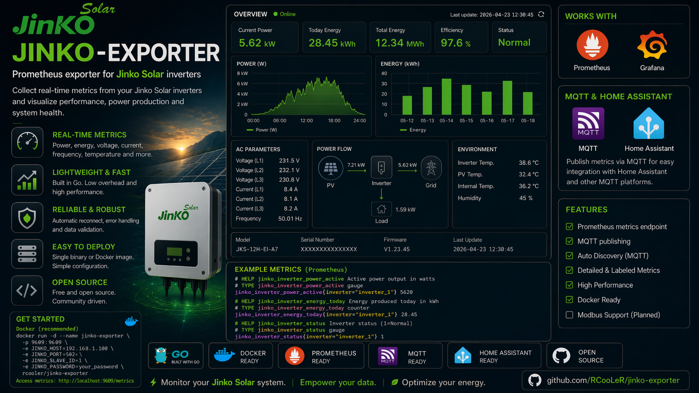

# JinkoBridge

JinkoBridge is an unofficial read-only solar telemetry bridge for Jinko and compatible Solarman-backed inverter data. It can poll Jinko, Solarman OpenAPI, or a locked local Solarman V5/Modbus profile in a strict ordered failover chain, exposes Prometheus metrics over HTTP, and can publish Home Assistant MQTT Discovery entities.

  

## Disclaimer

JinkoBridge is an unofficial DIY open-source project for compatibility, monitoring, and local automation. It is not affiliated with, endorsed by, sponsored by, or supported by Jinko Solar, Solarman, Deye, or any related vendor.

This project is read-only and does not send inverter control commands. It still depends on credentials, tokens, and third-party APIs that may change or stop working without notice. Do not use it as the only monitoring path for safety, billing, critical power, medical, or life-support decisions.

## Sources And Failover

Set `EXPORTER_SOURCE` for one source, or use
`EXPORTER_SOURCE_PRIORITY=modbus,jinko,solarman` for local-first failover after
a supervised Modbus-only validation fetch. Every listed source must be fully
configured. With `EXPORTER_METRICS_DROP_SOURCE_LABEL=true`, ordinary fallback
metrics are projected onto the learned primary label surface so a source switch
does not create duplicate Grafana series. MQTT deployments with multiple
sources must also set one stable, source-independent `MQTT_DEVICE_ID`.
For a stable Home Assistant entity surface across process restarts, configure
`MQTT_DISCOVERY_STATE_FILE` on the same private writable state mount. The
manifest preserves primary ordinary metrics, Shelly enrichment, and
source-scoped alert ownership without turning missing fallback values into
zeros.
The state directory must be writable by the effective container UID:GID because
updates use a same-directory atomic replacement. The image and example default
to `65532:65532`; if a deployment overrides `user` to match NAS ownership,
provision the directory for that identity. `read_only: true` protects the image
root filesystem but does not make the explicit state bind mount read-only.

The local source is the narrow, FC03-only
`jks-6-20h-ei-readonly-v1` profile. It is designed for the
JKS-6/8/10/12/15/20H-EI family shape, but only the 12 kW target has been fully
live-correlated. It has no Modbus write, arbitrary-register, scan, retry, or
same-fetch reconnect path. See the
[validation ledger](./bridge/docs/modbus-validation.md) for accepted evidence
and the [validation backlog](./bridge/docs/modbus-backlog.md) for intentionally
unsupported hardware and operating domains.

In `serve`, Jinko OAuth expiry tracking—and token rotation when refresh is
configured—continues in the background even while Modbus wins every telemetry
poll; healthy Modbus does not cause Jinko detail calls. Keep bootstrap tokens in
`*_FILE` secrets and give `JINKO_TOKEN_STATE_FILE` a dedicated private writable
mount so rotated state survives container replacement. Never commit tokens,
credentials, logger serials, device serials, or exported state files.

An optional Modbus alert-correlation worker can capture a non-zero raw warning
or fault vector, query both cloud sources concurrently for diagnostic evidence,
and send a dedicated Home Assistant notification. It never writes to the
inverter or changes source selection.

## Documentation

- [Bridge documentation](./bridge/docs/index.md)
- [Installation](./bridge/docs/installation.md)
- [Configuration](./bridge/docs/configuration.md)
- [Collected data](./bridge/docs/collected-data.md)
- [Local Modbus validation ledger](./bridge/docs/modbus-validation.md)
- [Local Modbus validation backlog](./bridge/docs/modbus-backlog.md)
- [Prometheus metrics](./bridge/docs/prometheus.md)
- [Home Assistant MQTT Discovery](./bridge/docs/home-assistant.md)
- [Alerts](./bridge/docs/alerts.md)
- [Home Assistant cards](./ha-cards/README.md)

## Repository Layout

- [`bridge/`](./bridge): Go bridge/exporter module, Dockerfile, tests, and bridge documentation.
- [`ha-cards/`](./ha-cards): optional Home Assistant Lovelace cards for the MQTT entities.
- [`assets/`](./assets): repository images used by documentation.

## License

MIT License. See [LICENSE](./LICENSE). See [NOTICE](./NOTICE) for trademark and affiliation notice.
